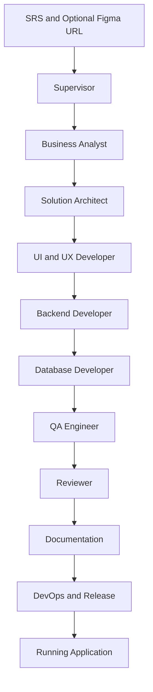

# Agentic SDLC Platform

## Overview
Agentic SDLC Platform is a production-ready, enterprise-grade, local-first platform that autonomously transforms a Software Requirements Specification and optional Figma reference into a fully implemented, tested, documented, and locally running application.

The platform is designed for deterministic, configuration-driven execution using markdown-defined agents, contract-governed subsystem interactions, and Supervisor-mediated human approvals.

## Key Features
| Capability | Description |
|---|---|
| Autonomous SDLC orchestration | Executes end-to-end lifecycle from requirements intake to runnable application output. |
| Multi-agent collaboration | Specialized agents contribute role-specific outputs through governed handoffs. |
| Supervisor-based execution | Central control authority manages progression, approvals, retries, and completion. |
| Workflow engine | Deterministic stage sequencing, dependency resolution, and state transitions. |
| Event-driven architecture | Services coordinate through structured lifecycle and domain events. |
| Artifact management | Versioned, traceable, immutable deliverables with strict ownership and lifecycle control. |
| Memory service | Centralized execution context, workflow memory, and recovery continuity references. |
| Validation engine | Centralized gatekeeping for contract compliance and progression safety. |
| Approval service | Human-in-the-loop decisions mediated through Supervisor only. |
| Observability | Metrics, traces, logs, dashboards, timelines, and diagnostic reporting. |
| Configuration-driven behavior | Runtime behavior is controlled through declarative settings and contracts. |
| Markdown-defined agents | Agent behavior and responsibilities are defined in versioned Markdown assets. |
| Local execution | Single-runtime, local-first operation for deterministic governance and control. |

## Architecture Overview
The architecture separates orchestration control, execution coordination, artifact and memory governance, validation and approval gates, and observability into distinct subsystems connected through contracts and events.

## Repository Structure
| Directory | Purpose |
|---|---|
| ai | Agents, prompts, skills, governance assets, and platform contracts. |
| scripts | Setup, build, run, and test lifecycle helper scripts, including frontend design-intake generation. |
| configs | Workflow, agent, model, and platform configuration controls. |
| orchestration | Core subsystem architecture and orchestration runtime modules. |
| artifacts | Generated stage outputs, reports, and lifecycle deliverables. |
| apps | Generated runnable applications and demonstration outputs. |
| templates | Reusable project and specification templates. |
| tests | Test assets and quality verification scaffolding. |
| scripts | Setup, build, run, and test lifecycle helper scripts. |
| docs | Architecture, execution, structure, and developer reference documentation. |
| events | Event domain support assets and event bus integration context. |
| memory | Memory domain support assets and memory service context. |
| observability | Logging, metrics, tracing, and observability support assets. |
| tools | Tooling interfaces used by runtime and agents. |

## Technology Stack
This project is implementation-aware but architecture-first. The planned stack is defined at capability level.

| Area | Direction |
|---|---|
| Language | Python-centric runtime with strong modular boundaries. |
| Runtime | Single local runtime for deterministic orchestration and governance. |
| LLM Integration | Configurable model provider abstraction controlled through model settings. |
| Configuration | Declarative configuration for agents, workflows, models, and platform behavior. |
| Testing | Multi-layer strategy covering unit, integration, workflow, and regression validation. |
| Documentation | Markdown-first architecture, contracts, and subsystem guides. |

## Execution Flow
At a high level, execution follows this lifecycle:

1. Load SRS input and optional Figma reference.
2. Initialize Supervisor and core orchestration services.
3. Progress through role-defined stages using artifacts as authoritative handoff outputs.
4. Apply validation and approval gates before state progression.
5. Finalize release outputs and run application locally.

Detailed flow is documented in [docs/execution-flow.md](docs/execution-flow.md).

## Documentation Index
### Core Architecture
1. [docs/architecture.md](docs/architecture.md)
2. [docs/execution-flow.md](docs/execution-flow.md)
3. [docs/project-structure.md](docs/project-structure.md)
4. [docs/developer-guide.md](docs/developer-guide.md)
5. [docs/setup.md](docs/setup.md)

### Subsystem Documentation
1. [orchestration/supervisor/README.md](orchestration/supervisor/README.md)
2. [orchestration/workflow/README.md](orchestration/workflow/README.md)
3. [orchestration/event-bus/README.md](orchestration/event-bus/README.md)
4. [orchestration/memory/README.md](orchestration/memory/README.md)
5. [orchestration/artifact/README.md](orchestration/artifact/README.md)
6. [orchestration/validation/README.md](orchestration/validation/README.md)
7. [orchestration/approval/README.md](orchestration/approval/README.md)
8. [orchestration/observability/README.md](orchestration/observability/README.md)

### Contracts
1. [ai/contracts/agent-contract.md](ai/contracts/agent-contract.md)
2. [ai/contracts/artifact-contracts.md](ai/contracts/artifact-contracts.md)
3. [ai/contracts/event-contracts.md](ai/contracts/event-contracts.md)
4. [ai/contracts/workflow-state.md](ai/contracts/workflow-state.md)
5. [ai/contracts/memory-contract.md](ai/contracts/memory-contract.md)
6. [ai/contracts/approval-contract.md](ai/contracts/approval-contract.md)
7. [ai/contracts/validation-contract.md](ai/contracts/validation-contract.md)
8. [ai/contracts/quality-report-contract.md](ai/contracts/quality-report-contract.md)

### Planned Additions
1. Architecture decisions document path: docs/architecture-decisions.md
2. Runtime subsystem path: orchestration/runtime/README.md

## Getting Started
Use this high-level onboarding path:

1. Read architecture and execution documents to understand system behavior and boundaries.
2. Review subsystem documentation for Supervisor, workflow, events, memory, artifact, validation, approval, and observability services.
3. Review contracts to understand mandatory interfaces and lifecycle expectations.
4. Review project structure and developer guide before contributing extensions.
5. Initialize your local environment and verify baseline workflow readiness.

This repository intentionally favors configuration and documentation over hardcoded orchestration behavior.

## Demonstration
The default demonstration scenario is a three-tier Task Management System.

Demonstration flow summary:

1. Input: Software Requirements Specification and optional Figma URL.
2. Execution: Autonomous multi-agent pipeline from requirements through release readiness.
3. Governance: Validation and approval gates control quality and risk decisions.
4. Output: Implemented, tested, documented, and locally runnable application.

## Roadmap
### Phase 1 - Documentation
Complete architecture, execution, contracts, subsystem guides, and developer onboarding references.

### Phase 2 - Core Orchestration
Harden Supervisor, workflow coordination, event bus, memory, artifact, and validation foundations.

### Phase 3 - Agent Runtime
Expand role completeness, skill reuse, agent contracts, and runtime governance behavior.

### Phase 4 - End-to-End Execution
Stabilize full SRS-to-running-app flow with robust validation, approvals, and observability.

### Phase 5 - Advanced Features
Enable advanced extensibility, richer ecosystem integrations, and enterprise-grade operational enhancements.

## Contributing
Contributions are welcome and should align with project principles:

1. Contract-first design and clear subsystem boundaries.
2. Configuration-driven behavior over hardcoded orchestration changes.
3. Strong documentation, validation, and test coverage for all extensions.
4. Backward-safe evolution of workflows, agents, and contracts.
5. Security, traceability, and observability as non-negotiable requirements.

Contributors should start with [docs/developer-guide.md](docs/developer-guide.md).

## Design Principles
The platform is guided by the following architectural philosophy:

1. Local-first, single-runtime governance.
2. Configuration over hardcoded logic.
3. Artifact-driven and event-driven coordination.
4. Contract-first interoperability across all subsystems.
5. Supervisor-mediated human approvals only.
6. Deterministic execution with complete traceability and auditability.

## Future Enhancements
Planned evolution areas include:

1. Plugin ecosystem for workflows, tools, validations, and skills.
2. Additional specialized agent types for domain and governance depth.
3. Remote execution profiles with explicit governance controls.
4. Multiple LLM provider integrations through abstraction and configuration.
5. Cloud deployment profiles for enterprise-hosted runtime options.
6. Workflow marketplace for reusable domain-specific lifecycle templates.

## License
License: To be defined.
