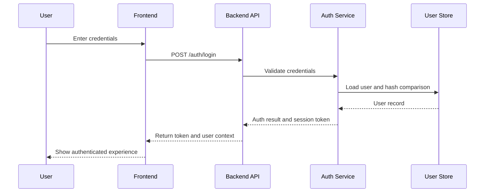
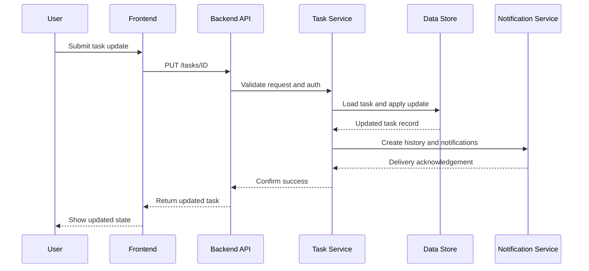

# Architecture Design

## Purpose
Describe the system architecture, component boundaries, integration contracts, and deployment strategy for the Task Management System.

## Metadata
- Version: 1.0.0
- Author: Solution Architect
- Date: 2026-07-01
- Status: Draft
- Architecture ID: ARCH-001
- Workflow ID: WF-20260701-001
- Correlation ID: CORR-20260701-001
- Traceability: requirements_spec.md, user_stories.md, acceptance_criteria.md, non_functional_requirements.md

## Executive Summary
The Task Management System is a secure, role-aware productivity platform designed for teams to create, manage, and monitor work with task lifecycle controls, collaboration, reporting, and auditability. The architecture separates presentation, business logic, and data persistence while preserving strong security, observability, and scalability characteristics.

## Architectural Overview
- Presentation: browser-based Single Page Application (SPA) that consumes RESTful JSON APIs and supports responsive, accessible UI aligned to the Figma design.
- Business Logic: API gateway and domain services providing authentication, task workflow, team management, notifications, reporting, and profile management.
- Data Persistence: relational data store for users, tasks, team relationships, activity history, comments, notifications, and audit metadata.
- Cross-Cutting Services: security, validation, logging, auditing, observability, configuration, and error handling.

## Architectural Goals
- Provide secure role-based access and enforce ownership and administrative controls.
- Enable rapid task search, filtering, and status transitions.
- Preserve audit history for user actions and task lifecycle events.
- Support responsive, accessible interactions across desktop and mobile.
- Deliver a maintainable architecture with clear component boundaries.
- Support at least 500 concurrent users and sub-2-second dashboard response.

## Constraints
- Implementation must remain technology-neutral at architecture level.
- Authentication must use secure transport and strong password handling.
- Audit data must be preserved for task and administrative actions.
- Dashboard response should be under 2 seconds for normal usage.
- The architecture must be ready for Docker-based deployment and CI/CD automation.

## System Context
External systems and dependencies:
- Identity provider / email service for password recovery and notifications.
- Browser clients for authenticated user access.
- Storage service for attachments and assets (object storage or file store).
- Monitoring/alerting platform for observability.

## Component Decomposition
- UI Client: task list, task detail, dashboard, settings, team management.
- Auth Service: registration, login, password reset, session management.
- Task Service: task CRUD, lifecycle workflows, status transitions, search.
- Team Service: role assignment, membership, invitations, permissions.
- Comment & Notification Service: task comments, notifications, mentions.
- Reporting Service: dashboards, summaries, workload views.
- Profile Service: user preferences, settings, avatar management.
- Persistence Layer: relational database schema and data access.
- Shared Infrastructure: logging, audit, observability, error handling.

## Design Decisions
- DEC-001: Use RESTful API design with JSON payloads for clear contract boundaries and compatibility with web clients.
- DEC-002: Use a relational database for task, user, team, comment, notification, and audit data to preserve consistency and support rich filtering.
- DEC-003: Use role-based access control (RBAC) with explicit ownership rules for administration, team lead, and member behaviors.
- DEC-004: Support Docker containerization as the primary deployment model for portability and CI/CD.
- DEC-005: Store audit trail entries for all authentication, task, team, notification, and profile changes.

## Epic/Feature/Story Coverage
- EPIC-001: Authentication and User Access → Auth Service, UI Client, Security Layer
- EPIC-002: Task Management and Collaboration → Task Service, Comment & Notification Service, Reporting Service
- EPIC-003: Team and Role Management → Team Service, RBAC Model
- EPIC-004: Dashboard, Notifications, and Reporting → Reporting Service, Notification Service
- EPIC-005: Profile, Settings, and System Configuration → Profile Service, UI Client

## Layer Responsibilities
- Presentation: UI Client, routing, session handling, client-side validation, accessibility.
- Business: service orchestration, permission enforcement, workflow rules, integration boundaries.
- Data: persistence, referential integrity, audit metadata, soft delete, versioning, search indexes.

## Folder Structure Boundaries
- presentation/: SPA source, views, components, assets.
- services/: API controllers, service layer, authorization policies.
- data/: repository interfaces, migrations, entities.
- shared/: validation, logging, configuration, error handling, security helpers.
- tests/: automated unit/integration tests for services, APIs, and data.
- docs/: API and architecture documentation.

## Interface Boundaries
- UI Client → API: REST/JSON over HTTPS.
- API → Database: parameterized SQL/ORM queries.
- API → Email/notification provider: asynchronous notification delivery.
- API → Attachment storage: secure upload/download integration.

## Interaction Model
- User → Auth Service: login, register, reset password.
- User → Task Service: create/edit/archive/restore tasks.
- User → Team Service: manage membership and roles.
- User → Comment Service: add comments and mention users.
- User → Reporting Service: fetch dashboard and reports.
- Task Service → Audit Store: record each state change.

## Sequence Diagrams

### Authentication Sequence

### Task Update Sequence

## Data and State Considerations
- Task state evolves through statuses: Todo, In Progress, Review, Completed, Blocked, Archived.
- Archived tasks are read-only for regular users and remain visible in search results.
- Task history and audit entries are immutable and linked to user/context metadata.
- User preferences and notification settings are stored per user.

## Navigation, Workflow, and State Transitions
- FLOW-001: Sign in → Dashboard or recovery confirmation.
- FLOW-002: Task list → Task detail → status transition → audit trail update.
- FLOW-003: Archive → read-only view → restore by admin.
- FLOW-004: Team management → membership change → immediate permission refresh.

## Responsibility Allocation
- UI Client: user interaction, accessibility, request composition.
- API Gateway: authentication, authorization, validation, routing.
- Domain Services: enforce business rules, handle workflows, publish notifications.
- Persistence Layer: enforce data integrity, store audit and activity history.

## Database Design Considerations
- Entities: User, Role, Team, TeamMembership, Task, TaskHistory, Comment, Notification, AuditEntry, UserPreference.
- Relationships: User → TeamMembership, Team → Task, Task → Comment, Task → TaskHistory, User → Notification.
- Cardinality: one-to-many for tasks to comments, tasks to history events, users to notifications.
- Constraints: unique email, valid status/priority values, due date not before current date.
- Audit fields: created_by, created_at, updated_by, updated_at, action_type, action_details.
- Soft delete: archived tasks flagged with `archived_at`; tasks permanently deleted only by administrator.
- Versioning: preserve historical task state changes via `TaskHistory`.

## Contract Coverage
- API Contracts: task management, authentication, teams, comments, notifications, reporting, profile.
- Data Contracts: request/response payload contracts for UI and service integrations.
- Integration Contracts: email service, attachment storage, observability.

## Integration Points
- I-001: Email service for password recovery and notifications.
- I-002: Attachment store for task attachments.
- I-003: Observability backend for logs/metrics/traces.

## Architecture Constraints
- AC-001: All API traffic must use HTTPS.
- AC-002: Passwords must be hashed and never logged in plain text.
- AC-003: Completed tasks are read-only for non-administrators.
- AC-004: Dashboard queries must return summaries within 2 seconds under normal load.
- AC-005: Search operations must respect user visibility and team scope.

## Security Design
- Authentication via secure credentials with session or token-based access.
- Role-based access control with administrator, team lead, and team member roles.
- Ownership-based authorization for task operations and team membership.
- Input validation and output encoding for all user-provided data.
- Audit logging for authentication, task changes, role changes, and administrative actions.

## Error Handling Strategy
- Use structured API error responses with code, message, and details.
- Validate user input at API boundary and return 4xx responses for client faults.
- Use 5xx responses for server faults and capture exceptions in observability.
- Provide business-friendly error messages for permission, validation, and workflow violations.

## Logging Strategy
- Record authenticated user ID, request correlation ID, action type, and outcome.
- Log task lifecycle events, permission denials, and system errors.
- Ensure no sensitive data (passwords, secrets) is persisted in logs.

## Audit Strategy
- Persist audit events for task creation, modification, status changes, archive/restore, comment activity, role updates, and login events.
- Keep audit records immutable and associated with user, timestamp, and related entity.

## Observability Strategy
- Collect metrics for API response latency, error rates, authentication failures, task search performance, and notification delivery.
- Trace request flow through authentication, task, team, and reporting services.
- Generate alerts for high error rates, slow dashboard responses, and failed notifications.

## Performance Strategy
- Optimize search and dashboard queries with indexed task attributes and summary views.
- Cache user preferences and common dashboard aggregates where appropriate.
- Limit payload sizes for list and detail responses.

## Scalability Strategy
- Separate UI from backend APIs to scale independently.
- Use horizontal scaling for stateless API services behind a load balancer.
- Use database connection pooling and query optimization for concurrent usage.

## Availability Strategy
- Deploy services in containerized infrastructure with redundancy.
- Use health checks and restart policies to recover failed API instances.
- Persist state in durable storage and back up critical data regularly.

## Deployment Considerations
- Target Docker-based deployment for application and supporting services.
- Support environment-specific configuration for dev, staging, and production.
- Use CI/CD pipelines to validate, build, test, and deploy artifacts.

## Cross-Cutting Concerns
- Logging, configuration, observability, auditing, and security are implemented as shared middleware/services.
- Authorization decisions are centralized and reusable across modules.
- Validation and error handling are consistently applied at API boundaries.

## Risks and Tradeoffs
- Using a relational database prioritizes consistency and auditability at the cost of more complex scaling than key-value stores.
- A single backend service simplifies development, while future decomposition can support microservices if necessary.
- Email-based recovery is included, while external OAuth is deferred to avoid scope creep.

## Traceability Mapping
- REQ-001 → Auth Service → /auth/* → User
- REQ-002/REQ-003/REQ-004 → Task Service → /tasks/* → Task, TaskHistory
- REQ-005/REQ-006 → Task Service → /tasks/search → Task indexes
- REQ-007/REQ-010 → Comment & Notification Service → /comments, /notifications
- REQ-008 → Team Service → /teams/* → Team, TeamMembership
- REQ-009 → Reporting Service → /dashboard, /reports
- REQ-011 → Profile Service → /profile, /settings
- REQ-012 → Audit Service → AuditEntry

## Missing Traceability
- None identified at architecture stage. All epics, features, and stories are mapped to components and API contracts.

## Open Questions
See `openlog.md` for open questions, assumptions, and decisions.

## Approval
- Prepared By: Solution Architect
- Reviewed By: Pending
- Approved By: Pending
