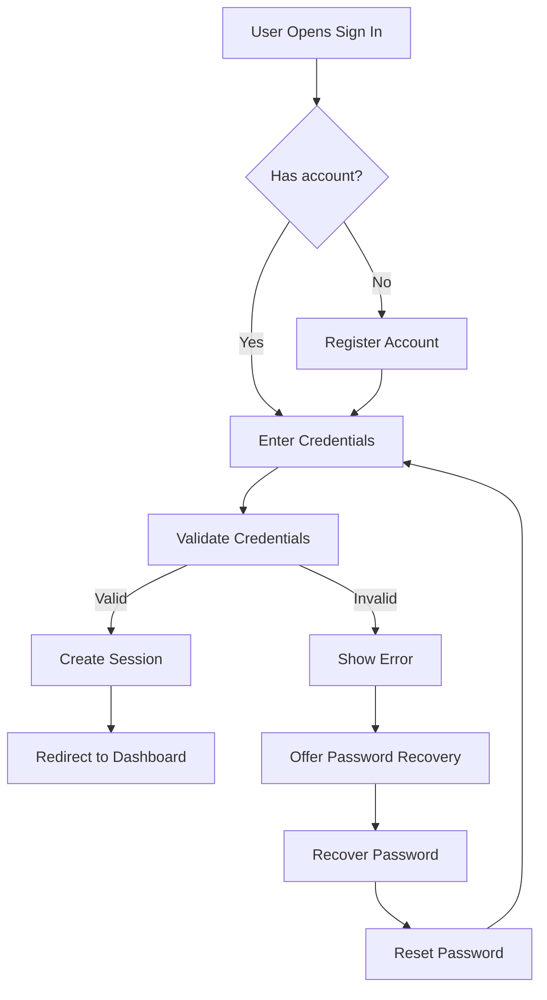

# Authentication Flow Diagram

## Purpose
Capture the core sign-in, authorization, and password recovery flow for the Task Management System.

## Diagram

## Notes
- This flow covers the main access and recovery journeys expected by the business requirements.
