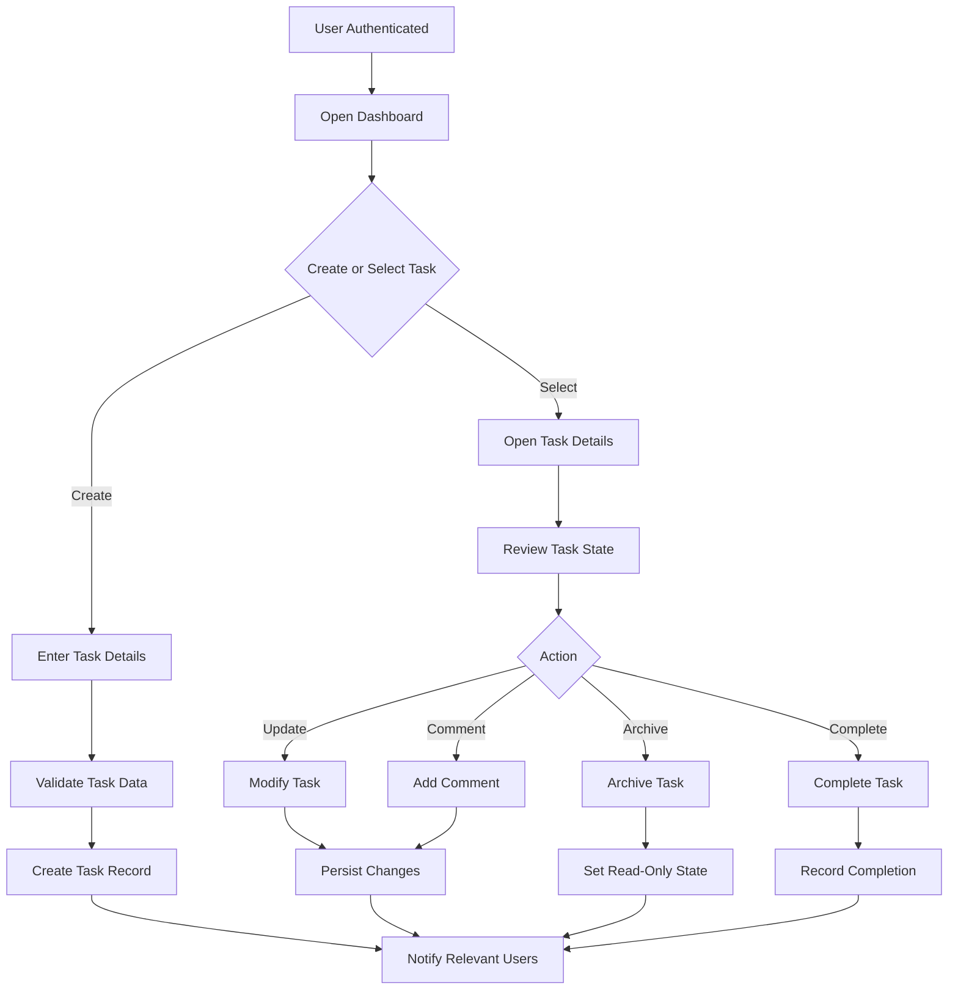

# Task Lifecycle Flow Diagram

## Purpose
Capture the business flow for creating, updating, archiving, and completing a task.

## Diagram

## Notes
- This flow reflects the business lifecycle and should be used for implementation planning and QA.
