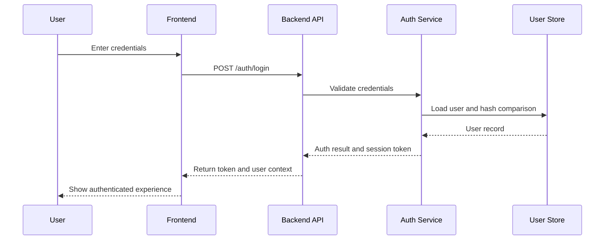

# Authentication Sequence Diagram

## Purpose
Describe the authentication flow from sign-in through session creation.

## Diagram

## Notes
- This diagram highlights the main authentication interactions for implementation and testing.
