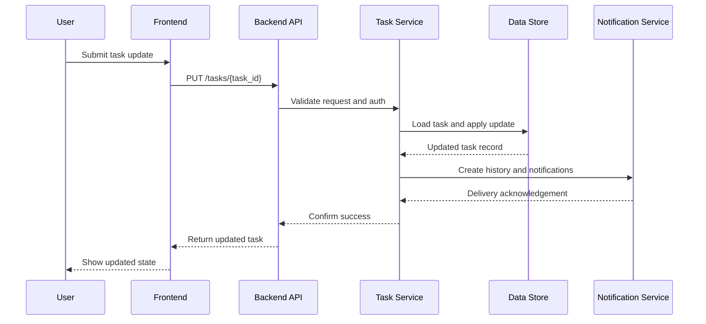

# Task Update Sequence Diagram

## Purpose
Describe the interactions involved when a user updates a task and the system persists the change.

## Diagram

## Notes
- This sequence diagram is intended to guide backend implementation and QA validation.
