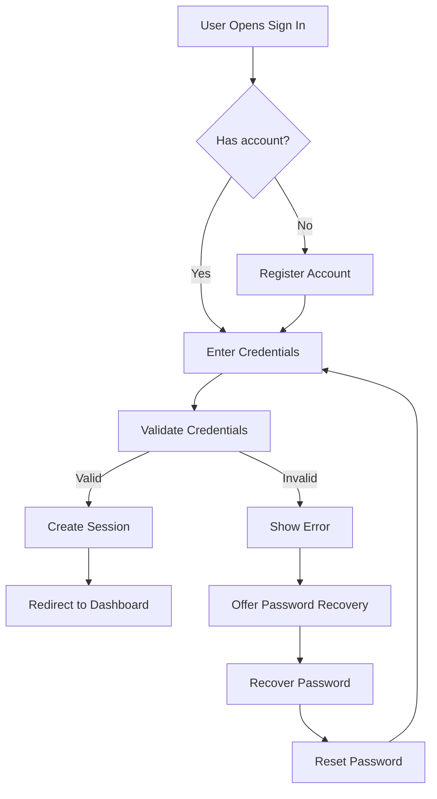
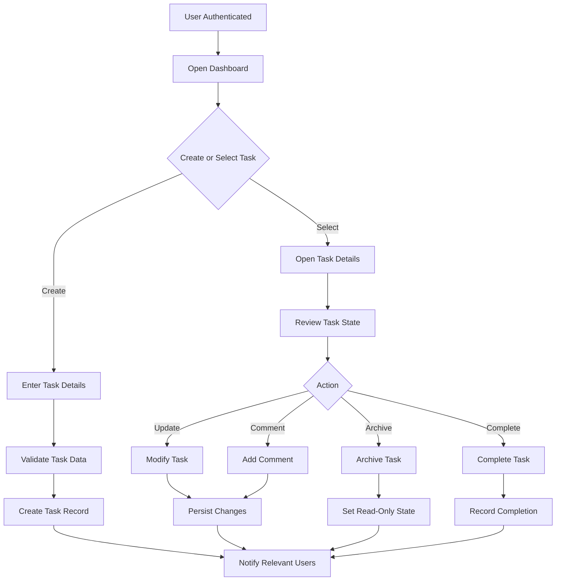

# Business Process Flows

## Purpose
Capture the main business workflows and process steps for the Task Management System.

## Metadata
- Version: 1.0.0
- Author: Business Analyst
- Date: 2026-07-02
- Status: Draft
- Workflow ID: WF-20260701-001
- Related Artifacts: requirements_spec.md, user_stories.md, acceptance_criteria.md

## Core Flows

### Flow: User Sign-In
1. User opens the sign-in screen.
2. User enters valid credentials.
3. System authenticates the user.
4. System presents the dashboard or appropriate landing page.

### Flow: Create and Manage a Task
1. User selects the task creation action.
2. User enters task details and assigns ownership.
3. System validates the task data.
4. System creates the task and records it for tracking.
5. User or team members can update, comment, archive, or complete the task.

### Flow: Review and Complete Work
1. Assigned user updates task progress.
2. Team lead or reviewer validates status and completion readiness.
3. Task moves through the business lifecycle until final completion or archival.
4. System records activity history and notifications.

### Flow: Team and Role Administration
1. Administrator manages users, teams, and role assignments.
2. Team lead manages membership and team-level work.
3. System enforces role-based access and visibility rules.

## Flow Diagrams

### Authentication Flow

### Task Lifecycle Flow

